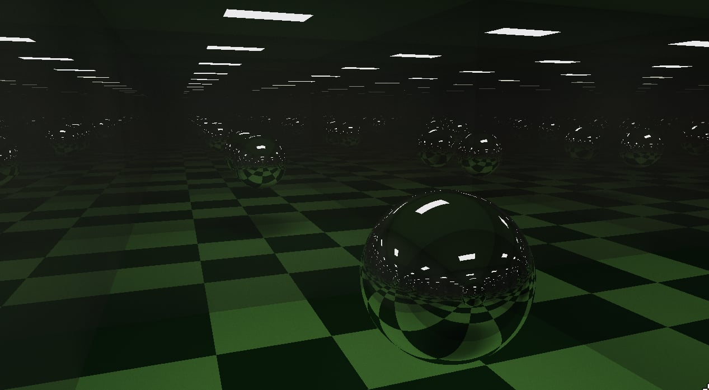
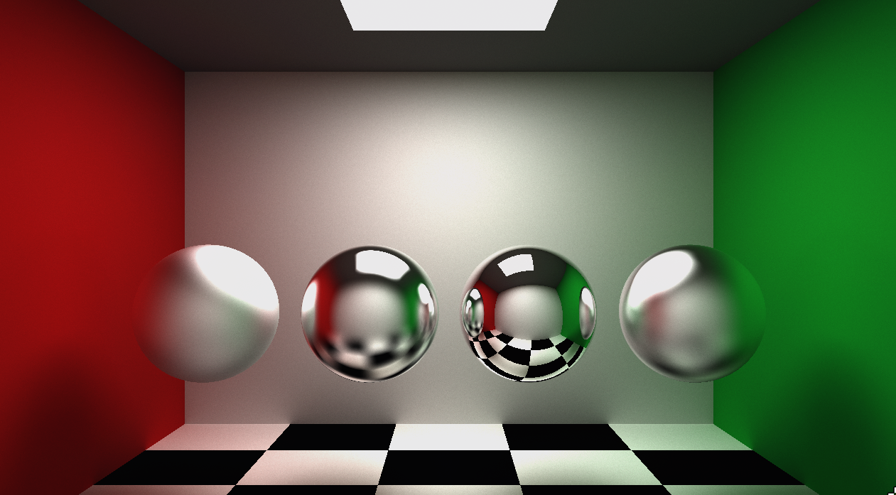
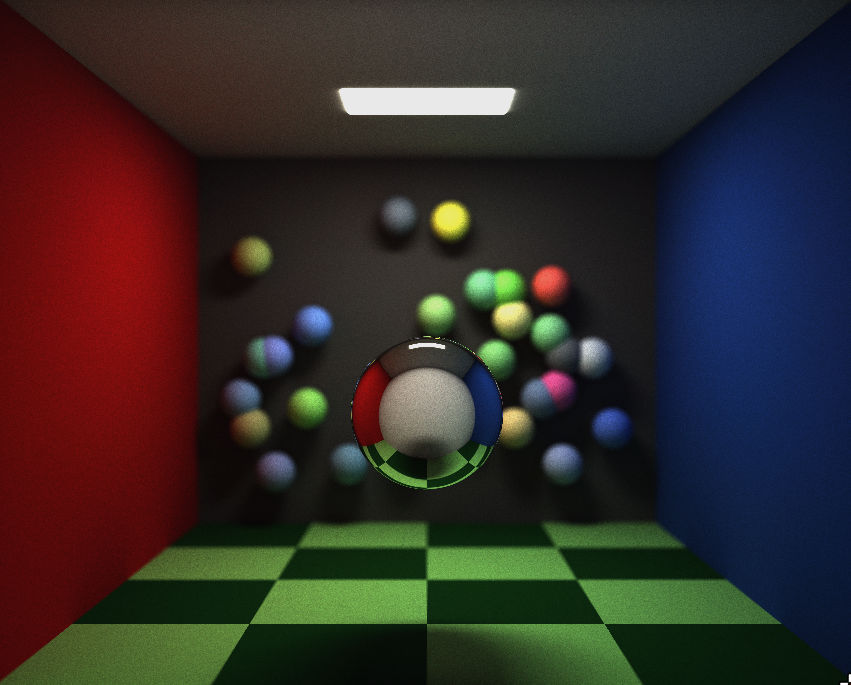

# Raytracer

This is a small GPU raytracer written as a learning project. It renders a scene in real time and slowly cleans up the image while it stays still.

## What is raytracing?

Raytracing is a way of rendering images by following rays of light. Instead of drawing only the visible surfaces of an object, it asks what a ray from the camera hits, how that surface reflects or scatters light, and where the next ray goes. Repeating that process creates shadows, reflections, soft lighting, and depth of field that feel more natural.

## How raytracing works

For every pixel, the renderer sends one or more rays from the camera into the scene. A ray can hit a sphere or a triangle. When it hits something, the material decides whether the ray scatters like a matte surface or reflects like a smooth one. Emissive surfaces add light to the result. The ray then continues for a limited number of bounces.

The shader uses random samples to make the lighting look less artificial. A single frame is noisy, so the renderer keeps an accumulation buffer and averages new frames with earlier ones. Leave the camera still for a moment and the image becomes cleaner. Moving the camera resets that accumulation.

## How this raytracer works

The application draws a full-screen quad with OpenGL. The fragment shader does the raytracing work on the GPU. Spheres and triangles are uploaded to the shader through uniform buffers, and quads are built from triangles. The current scene uses emissive geometry for indoor lighting and can also use a procedural sky and sun.

The default scene is selected in `Scene::Setup()` inside `src/scene.cpp`. It is a small room with coloured walls, a checkerboard floor, an area light, and reflective spheres. The project also contains other scene functions that can be enabled from the same file.

## What this raytracer is written with

The program is written in C++17. OpenGL 3.3 is used to display the result and run the GLSL shaders. GLFW creates the window and handles input, GLAD loads OpenGL functions, and GLM provides vector and matrix math. GLFW, GLAD, and GLM are included in the `libraries` directory.

## How to install

You need CMake 3.20 or newer, a C++17 compiler, and the development files for OpenGL and X11 on Linux. On Debian or Ubuntu, install the required system packages with:

```bash
sudo apt install build-essential cmake libgl1-mesa-dev xorg-dev
```

Then configure and build the project from its root directory:

```bash
cmake -S . -B build
cmake --build build
```

## How to run

Run the program from the build directory. This matters because the program loads the shaders from `../shaders`.

```bash
cd build
./raytracer
```

Use the mouse to look around. Use `W`, `A`, `S`, and `D` to move, `Space` to move up, and left `Ctrl` to move down. Press `R` to reset the camera. Some scenes disable movement and mouse input on purpose.

## How to set up a scene

Open `src/scene.cpp` and edit the scene function called by `Scene::Setup()`. Add spheres through `sphereManager.AddSphere(...)`. Add triangles through `triangleManager`, or use `Quad(...)` when you want a simple rectangular surface. Each object accepts a colour, emission settings, smoothness, specular probability, and specular colour.

You can also change the camera position, yaw, pitch, focus distance, and defocus strength in the selected scene. Render settings such as the maximum bounce count and rays per pixel are near the top of `src/main.cpp`. Higher values can improve the image, but they also make rendering slower.

## Screenshots






## More updates are coming

This project is still growing. More scene tools, materials, lighting improvements, and general cleanup are planned for future updates.

## Credits

Built with GLFW, GLAD, and GLM. The project also draws inspiration from the many raytracing tutorials and graphics programming resources shared by the open-source community.

Special thanks to [Sebastian Lague](https://www.youtube.com/watch?v=Qz0KTGYJtUk&list=PLFt_AvWsXl0dlgwe4JQ0oZuleqOTjmox3) for his excellent raytracing series.

Additional resources:
- [Ray Tracing in One Weekend](https://raytracing.github.io/)
- [Casual Shadertoy Path Tracing 1: Basic Camera, Diffuse, Emissive](https://blog.demofox.org/2020/05/25/casual-shadertoy-path-tracing-1-basic-camera-diffuse-emissive/)